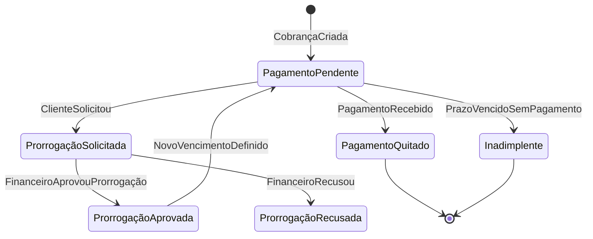
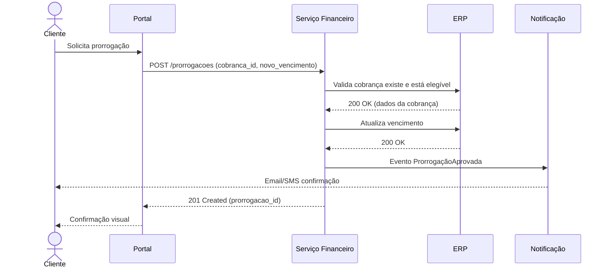
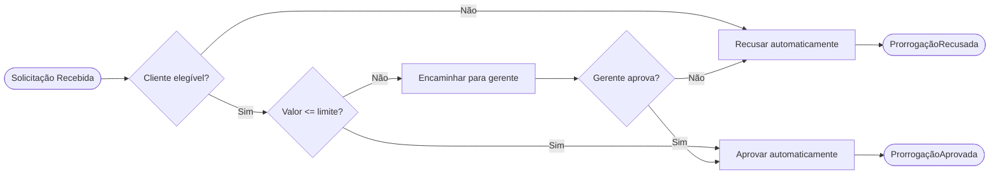

# Diagram-as-Code

## Posição no Pipeline

```
Passo 7 / 8

Entrada : project.yaml → docs.files.state_machine  (modelo de estados → stateDiagram-v2)
          project.yaml → docs.files.schema          (entidades → erDiagram ou flowchart)
          project.yaml → docs.files.domain_events  (sequência → sequenceDiagram)
          project.yaml → systems[]                  (participantes do sequenceDiagram de integração)
Saída   : project.yaml → docs.files.diagrams

Pré-requisitos : contract-engineering (passo 6)
Próximo passo  : executive-technical-synthesis (→ delta_info, pdd)
```

> **Renderização:** todos os diagramas em `diagrams` devem usar Mermaid (suportado pelo
> compilador `build.js`). PlantUML e D2 requerem pré-compilação externa.

---

## Objetivo

Versionar **conhecimento operacional** como artefato computável — não como PNG estático, não como Lucidchart preso em uma conta, não como draw.io não rastreável. Código que gera diagrama é documentação que o git pode auditar.

## Por que isso é maduro

Um diagrama como imagem morre na pasta de Downloads. Um diagrama como código:
- Vive no repositório junto com o código que documenta
- Tem histórico de mudanças (quem mudou, quando, por quê)
- Pode ser revisado em pull request
- Pode ser gerado automaticamente a partir de dados do sistema
- Não requer ferramenta proprietária para editar

## Seleção da linguagem de diagrama

Escolha baseada no tipo de diagrama:

| Tipo | Linguagem | Quando usar |
|------|-----------|-------------|
| Fluxo de processo | Mermaid `flowchart` | Sequência de decisões e ações |
| Máquina de estados | Mermaid `stateDiagram-v2` | Ciclos de vida, estados e transições |
| Sequência de mensagens | Mermaid `sequenceDiagram` | Interações entre sistemas/atores |
| Modelo entidade-relação | Mermaid `erDiagram` | Estrutura de dados e relacionamentos |
| Gantt/cronograma | Mermaid `gantt` | Linha do tempo de projeto |
| Arquitetura C4 | PlantUML C4 | Contexto, containers, componentes |
| Infraestrutura cloud | Diagrams (Python) | AWS/GCP/Azure com componentes reais |
| Mindmap | Mermaid `mindmap` | Hierarquia de conceitos |

## Princípios de um bom diagrama-como-código

### Clareza sobre completude
Um diagrama que mostra tudo não mostra nada. Escolha o nível de abstração correto para o público e o objetivo. Um diagrama C4 de contexto não mostra tabelas de banco de dados.

### Nomeação consistente com o domínio
Use os mesmos nomes do glossário canônico (`025-glossario-canonico.md`) e do SSOT `glossary.yaml` (skill `glossario`). Se o domínio usa "prorrogação", o diagrama usa "prorrogação" — não "extensão", não "postponement". **Rótulos Mermaid são SVG** — o `title` de decodificação no hover **não** os alcança; então **não use sigla crua** em nó/aresta: escreva por extenso (a sigla fica decodificada na **prosa** ao redor). Toda sigla nova que aparecer → registre no `glossary.yaml`.

### Direção de fluxo consistente
Escolha uma direção (LR = esquerda para direita, TB = top to bottom) e mantenha em todos os diagramas do mesmo projeto.

### Comentários explicativos
```mermaid
%% Este diagrama mostra o fluxo de aprovação de prorrogação
%% Última atualização: quando ProrrogacaoAprovada foi adicionada ao domínio
```

## Recipes por tipo de diagrama

### Máquina de estados (processo de cobrança)


### Sequência de integração


### Fluxo de decisão


## Processo de criação

### 1. Definir o objetivo do diagrama
O que o leitor deve entender ao terminar de ver este diagrama? Formule em uma frase.

### 2. Identificar o público
Executivo, desenvolvedor, analista de negócio? O nível de detalhe muda radicalmente.

### 3. Selecionar o tipo de diagrama
Use a tabela acima. Misturar tipos em um único diagrama geralmente confunde mais do que esclarece.

### 4. Rascunhar em pseudocódigo
Escreva os nós e conexões antes de se preocupar com sintaxe. Valide a lógica primeiro.

### 5. Codificar e iterar
Converta o rascunho para a linguagem escolhida. Renderize. Pergunte: "o que está faltando?" e "o que está sobrando?"

## Anti-patterns

**O diagrama de tudo**: um único diagrama com 40 nós e 60 conexões. Divida por nível de abstração ou por subdomínio.

**Nomes genéricos**: "Sistema A → Sistema B". Use nomes do domínio.

**Diagrama desatualizado**: um diagrama errado é pior que nenhum diagrama. Coloque-o no mesmo PR da mudança que o torna necessário.

**Direção inconsistente**: alguns subgrafos LR, outros TB no mesmo diagrama.
